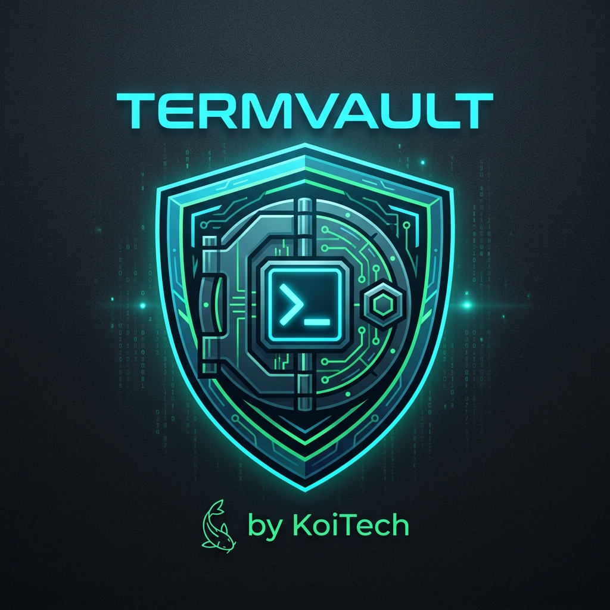

<div align="center">

  

  # 🛡️ SecOps TermVault
  ### The Air-Gapped Terminal Command & Cyber Terminology Management Platform
  **Engineered for Cybersecurity Managers, Red/Blue Teams, and Technical Leaders**

  <p>
    <a href="#-quick-start"></a>
    <a href="#-tech-stack"></a>
    <a href="#-air-gap-ready"></a>
    <a href="#-authorship--organization"></a>
    <a href="#-authorship--organization"></a>
  </p>

  <p>
    <b>Stop forgetting complex CLI one-liners, tool shortcuts, and framework tactics.</b><br>
    Store, parameterize, search, and copy terminal codes in sub-seconds.
  </p>

</div>

---

## 📑 Table of Contents

- [The Problem](#-the-problem)
- [Key Features](#-key-features)
- [Preloaded Security Arsenal](#-preloaded-security-arsenal)
- [Quick Start](#-quick-start)
- [Keyboard Shortcuts](#-keyboard-shortcuts)
- [Dynamic Parameter Injector](#-dynamic-parameter-injector)
- [System Architecture](#-system-architecture)
- [REST API Reference](#-rest-api-reference)
- [Air-Gap & Lab Security](#-air-gap--lab-security)
- [Authorship & Organization](#-authorship--organization)
- [License](#-license)

---

## 💡 The Problem

As cybersecurity managers, tech leads, and penetration testers, we live in the terminal. On any given day, we interact with dozens of disparate CLI utilities:
- Typing `agy` to launch **Google Antigravity** in our Kali environment
- Crafting 15-flag `nmap` stealth scans with script engines
- Spawning reverse shell listeners via `nc`
- Hunting rogue sockets with `ss -tulnp`
- Parsing authentication logs for brute-force attacks
- Referencing MITRE ATT&CK tactic IDs during purple team exercises

Static markdown cheat sheets get cluttered, browser bookmarks get buried, and digging through shell histories (`Ctrl+R` / `history | grep`) wastes critical seconds during an audit or live incident.

**TermVault** was built by **KoiTech** to provide an instant, elegant, local platform to store and search all terminal commands and cybersecurity terminology in under a second.

---

## ⚡ Key Features

| Feature | Description |
| :--- | :--- |
| 🔍 **Sub-Second Fuzzy Search** | Press `/` from anywhere to immediately search across titles, commands, descriptions, and tags. |
| 🎯 **Spotlight Command Palette** | Press `Ctrl + K` (or `Cmd + K`) for an IDE-style popup. Navigate with Arrow keys and press `Enter` to copy. |
| 🧪 **Interactive Parameter Injector** | Placeholders like `<target_ip>` or `<port>` auto-trigger a variable builder. Type your values and get the completed command ready for execution. |
| 🟢 **Color-Coded Risk Matrix** | Visual safety tiers (**Safe**, **Notice**, **Elevated**, **Dangerous**) prevent junior analysts or tired managers from executing destructive commands. |
| ⭐ **Pinned Favorites & Usage Counter** | Pin frequently used commands (e.g. `agy`) and let the platform track execution frequencies. |
| 🔒 **100% Air-Gapped & Zero-Bloat** | Pure **HTML5, CSS3, Vanilla JS, and PHP**. No external CDNs, no npm dependencies, no heavy database daemons. |
| 📦 **Atomic JSON Persistence & Sync** | High-reliability atomic writes with `LOCK_EX`. One-click JSON backup export and merge-import across Kali machines. |

---

## 🧰 Preloaded Security Arsenal

TermVault arrives out-of-the-box with pre-configured commands across critical domains:

```
[CLI & Workflows]
  ├─ Start Antigravity (AGY) CLI / IDE             --> agy
  ├─ Check Antigravity Status & Version            --> agy --version && agy status
  └─ Quick Python 3 HTTP Server                    --> python3 -m http.server <port>

[Recon & Scanning]
  └─ Nmap Comprehensive Stealth SYN Scan           --> nmap -sS -sV -sC -O -T4 -p- -v <target_ip>

[Exploitation & Shells]
  └─ Netcat Reverse Shell Listener                 --> nc -lvnp <port>

[Incident Response & Threat Hunting]
  ├─ List All Active Listening Sockets & PIDs      --> sudo ss -tulnp | grep LISTEN
  └─ Analyze Failed SSH Login Attempts             --> grep "Failed password" /var/log/auth.log ...

[Linux Admin & Hardening]
  ├─ Find SUID Binaries (PrivEsc Audit)            --> find / -perm -4000 -type f ...
  └─ Inspect UFW Firewall Rules with Index Numbers --> sudo ufw status numbered

[Network Defense]
  └─ TShark Live Packet Capture (HTTP/HTTPS)       --> sudo tshark -i <interface> -f "..."

[Web App Security]
  └─ Gobuster Web Directory Enumeration            --> gobuster dir -u <url> -w ...

[Terminology & Frameworks]
  ├─ Zero Trust Architecture (NIST SP 800-207)
  └─ MITRE ATT&CK Matrix Tactic IDs (TA0001 - TA0043)
```

---

## 🚀 Quick Start

### 1. Launch via Startup Script
From your Kali terminal:
```bash
cd /dic/location
./start.sh
```

### 2. Or Launch via PHP Built-in Server
```bash
php -S 127.0.0.1:8080 -t /dir/location
```

Then navigate to **`http://localhost:8080`** in your browser.

### 3. Add a Shell Alias (Optional)
To launch TermVault from anywhere simply by typing `vault`:
```bash
echo 'alias vault="bash /dir/location/start.sh"' >> ~/.bashrc
source ~/.bashrc
```

---

## ⌨️ Keyboard Shortcuts

| Shortcut | Action |
| :--- | :--- |
| <kbd>/</kbd> | Focus the instant search bar |
| <kbd>Ctrl</kbd> + <kbd>K</kbd> / <kbd>⌘</kbd> + <kbd>K</kbd> | Toggle Spotlight Command Palette |
| <kbd>↑</kbd> / <kbd>↓</kbd> | Navigate command results in the Palette |
| <kbd>Enter</kbd> | Copy selected command from Palette to clipboard |
| <kbd>Esc</kbd> | Close any active modal or clear search query |

---

## 🧪 Dynamic Parameter Injector

Any command stored with `<placeholder>` or `{{placeholder}}` syntax automatically unlocks the **"Fill"** button:

### Example Template:
```bash
nmap -sS -sV -sC -O -T4 -p- -v <target_ip> -oN scan_<target_ip>.txt
```

1. Click **Fill** on the command card.
2. Enter your target (e.g. `192.168.1.50`).
3. The platform dynamically renders:
   ```bash
   nmap -sS -sV -sC -O -T4 -p- -v 192.168.1.50 -oN scan_192.168.1.50.txt
   ```
4. Click **Copy Prepared Command** to transfer it to your terminal clipboard.

---

## 🏗️ System Architecture

```
my_data/
├── index.php                 # Core Application Dashboard (HTML5 / PHP)
├── api.php                   # Lightweight JSON REST API
├── start.sh                  # One-click Server Launcher & Port Resolver
├── README.md                 # Complete Repository Documentation
├── assets/
│   ├── css/
│   │   └── style.css         # Cyber Terminal Theme & Glassmorphism Styles
│   ├── js/
│   │   └── app.js            # Reactive State, Search Engine & Audio Synth
│   └── img/
│       ├── logo.png          # High-Resolution TermVault Logo
│       └── logo.jpg          # Alternate Format Asset
├── data/
│   └── commands.json         # Atomic File-Locked Database
└── linkedin/
    └── linkedin              # Official Launch Announcement Post
```

---

## 📡 REST API Reference

The backend `api.php` provides a RESTful interface:

| Endpoint | Method | Description | Parameters / Payload |
| :--- | :---: | :--- | :--- |
| `api.php?action=list` | `GET` | List & filter commands | `q`, `category`, `tag`, `favorite`, `sort` |
| `api.php?action=stats` | `GET` | Retrieve metrics & system signature | None |
| `api.php?action=categories` | `GET` | Get category counts | None |
| `api.php?action=tags` | `GET` | Get tag distribution | None |
| `api.php?action=create` | `POST` | Create new command / term | JSON body: `title`, `command`, `category`, `tags`, `risk_level`, `description` |
| `api.php?action=update` | `POST` | Update existing command | JSON body: `id`, `title`, `command`, ... |
| `api.php?action=delete` | `POST` | Delete command by ID | JSON body: `id` |
| `api.php?action=toggle_favorite` | `POST` | Star or unstar item | JSON body: `id` |
| `api.php?action=increment_copy` | `POST` | Increment usage counter | JSON body: `id` |
| `api.php?action=export` | `GET` | Download full `.json` backup | None |
| `api.php?action=import` | `POST` | Import JSON backup | `mode=merge` or `mode=replace` |

---

## 🔒 Air-Gap & Lab Security

- **Zero External Network Calls:** All SVG icons, font definitions, styles, and scripts are self-contained locally.
- **Audio Feedback Synthesis:** Web Audio API generates audio clicks/beeps dynamically using an internal sine oscillator without needing external `.wav`/`.mp3` audio files.
- **Concurrency Protection:** Multi-tab write operations are safeguarded using atomic file creation (`LOCK_EX`) and atomic rename operations.

---

## 👤 Authorship & Organization

- **Lead Architect:** `0745` (Cyber Security Manager)
- **Organization:** `KoiTech`
- **Operational Codename:** `0745`
- **Classification:** Internal Security Operations Platform

---

## 📄 License

This software is licensed under the **MIT License**. Engineered for defensive security operations, penetration testing, and technical leadership workflows.
